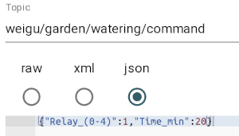
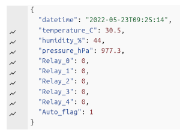

# Watering the garden with valves per MQTT over WiFi using an ESP8266


## All infos on: <http://www.weigu.lu/microcontroller/garden_watering/index.html>

## Some infos

The vegetable garden must be regularly supplied with water. To save water, I use drip hoses, and to simplify my life, I have automated the control of the irrigation.

It began with a command of a box with 5 magnetic valves from Hunter. The box contained 5 valves Hunter PGV 101 MMB (3/4", 25&#8239;mm). The valves need 24&#8239;VAC, so we need a transformer. As the valves are never open at the same time a current of 1&#8239;A should suffice. There are cheap relay shields out there with Optocoupler, perfect for this project. An ESP8266 ([Lolin/Wemos D1 mini pro V2 ](https://www.wemos.cc/en/latest/d1/d1_mini_pro.html)) connects us with the network over WiFi and MQTT and is used to send commands and get data. The ESP8266 board is also powered by the transformer. This is done with a LM2596 DC/DC buck converter breakout board.

As the whole thing is contained in a  IP65 waterproof enclosure, I wanted to monitor temperature and humidity in the box and added a BMP280 sensor. A piece of PLA from my 3D printer created with FreeCAD (files on git) helped to connect everything together.

### BOM

- 5 valves Hunter PGV 101 MMB (3/4", 25&#8239;mm, 24&#8239;VAC)
- Trafo 24&#8239;VAC
- 8 Channel DC 5&#8239;V AC 230&#8239;V Relay Shield with Optocoupler
- LM2596 DC/DC Buck Converter
- Lolin/Wemos D1 mini pro V2
- BMP280 breakout board
- BOPLA ET-237 Euromas II, 200x120x90&#8239;mm³, IP65

### Software

The software communicates per `MQTT` over `WiFi`. It uses my ESPToolbox library for WiFi and logging functions and to get the time. To avoid version problems the lib is included in the sketch folder. Programming is done over OTA.

We get two topics:

```C
    String MQTT_TOPIC_OUT = "weigu/garden/watering/data";
    String MQTT_TOPIC_IN = "weigu/garden/watering/command";
```

Commands are in JSON and have the following JSON format (I eliminated the square brackets in the new version (1.1) because openHAB had problems with those when transforming):

```json
    {"Relay_(0-4)":4,"Time_min":20}
    {"Auto_(0-1)":1}    
```



Watering stops automatically after x minutes. To stop manually the time is set to zero:

```json
    {"Relay_(0-4)":4,"Time_min":0}
```

In the new version (1.1) we get an automatic watering if needed and we can switch automatic watering on (1) or off (0).

The following is seen on the data channel:



In the new version all relevant data you must or can change are in a config (`config.h`) file, also contained in the main folder. You can also place this file in the sketchbook/library folder named `Secrets` and rename it to your needs (e.g. `secrets.h`).

In the main file (.ino) you can activate or deactivate features by commenting or uncommenting some lines. Here you must activate `USE_SECRETS`.

In the `config.h` file, you must change the WiFi parameter and the MQTT server address. In the automated watering array we define the timers and duration of watering events. If we want that relay 3 opens at 15h15 for 15 minutes we add the line: 

```C
      {3,1515,15},
```

to the array.

Other things we perhaps want to change are the publishing interval `PUBLISH_TIME` or the MQTT topics.