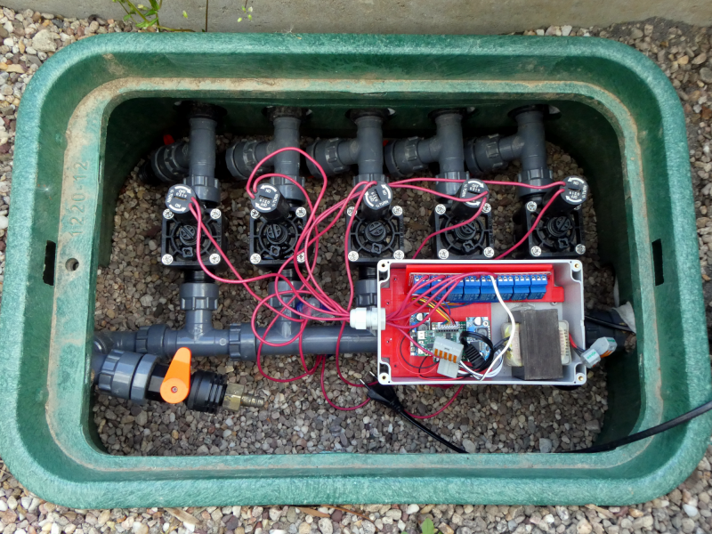

# Watering the garden with valves per MQTT over WiFi using an ESP8266

## All infos on: <http://www.weigu.lu/microcontroller/garden_watering/index.html>

## Some infos

The vegetable garden must be regularly supplied with water. To save water, I use drip hoses, and to simplify my life, I have automated the control of the irrigation.

It began with a command of a box with 5 magnetic valves from Hunter. The box contained 5 valves Hunter PGV 101 MMB (3/4", 25&#8239;mm). The valves need 24&#8239;VAC, so we need a transformer. As the valves are never open at the same time a current of 1&#8239;A should suffice. There are cheap relay shields out there with Optocoupler, perfect for this project. An ESP8266 ([Lolin/Wemos D1 mini pro V2 ](https://www.wemos.cc/en/latest/d1/d1_mini_pro.html)) connects us with the network over WiFi and MQTT and is used to send commands and get data. The ESP8266 board is also powered by the transformer. This is done with a LM2596 DC/DC buck converter breakout board.

As the whole thing is contained in a  IP65 waterproof enclosure, I wanted to monitor temperature and humidity in the box and added a BMP280 sensor. A piece of PLA from my 3D printer created with FreeCAD (files on git) helped to connect everything together.

#### BOM

- 5 valves Hunter PGV 101 MMB (3/4", 25&#8239;mm, 24&#8239;VAC)
- Trafo 24&#8239;VAC
- 8 Channel DC 5&#8239;V AC 230&#8239;V Relay Shield with Optocoupler
- LM2596 DC/DC Buck Converter
- Lolin/Wemos D1 mini pro V2
- BMP280 breakout board
- BOPLA ET-237 Euromas II, 200x120x90&#8239;mm³, IP65
